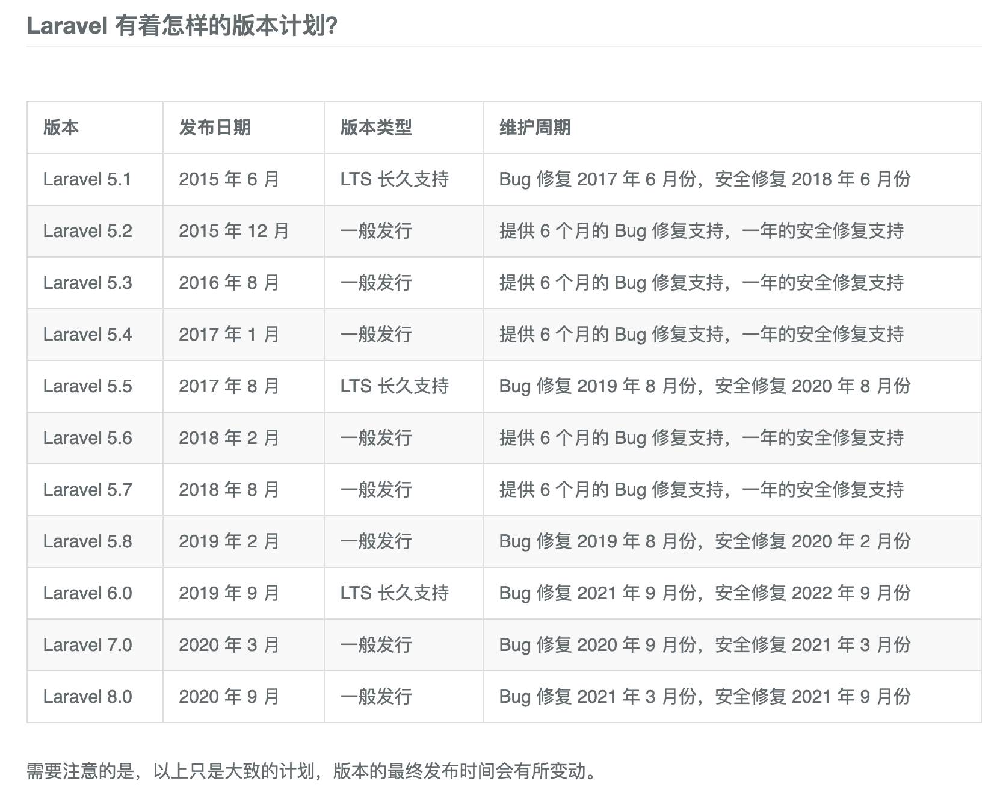

#### laravel版本


#### 安装laravel的环境要求

- PHP >= 7.3
- BCMath PHP 拓展
- Ctype PHP 拓展
- Fileinfo PHP 拓展
- JSON PHP 拓展
- Mbstring PHP 拓展
- OpenSSL PHP 拓展
- PDO PHP 拓展
- Tokenizer PHP 拓展
- XML PHP 拓展

#### composer方式安装laravel
```
composer create-project --prefer-dist laravel/laravel blog
```

- storage 目录和 bootstrap/cache 需要写权限
- 生成应用秘钥 `php artisan key:generate`（密钥32个字符，保存在.env）
- `php artisan serve`提供web服务，访问地址 http://localhost:8000/
- `composer global require laravel/installer` laravel安装器，即laravel可执行文件，当命令试用，如`laravel new blog`。
- 将命令laravel加入bin`export PATH="$PATH:$HOME/.composer/vendor/bin"`

#### Linux系统下生成证书

参考：https://www.cnblogs.com/isylar/p/10002117.html

1. 生成秘钥key,获得了一个server.key文件:
```
$ openssl genrsa -des3 -out server.key 2048
```

2. 如果想去除输入密码的步骤可以使用以下命令:
```
$ openssl rsa -in server.key -out server.key
```

3. 创建服务器证书的申请文件server.csr,运行:
```
openssl req -new -key server.key -out server.csr
```
其中Country Name填CN,Common Name填主机名也可以不填,如果不填浏览器会认为不安全.(例如你以后的url为https://abcd/xxxx….这里就可以填abcd),其他的都可以不填.

4. 创建CA证书:
```
openssl req -new -x509 -key server.key -out ca.crt -days 3650
```
此时,你可以得到一个ca.crt的证书,这个证书用来给自己的证书签名.

5. 创建自当前日期起有效期为期十年的服务器证书server.crt：
```
openssl x509 -req -days 3650 -in server.csr -CA ca.crt -CAkey server.key -CAcreateserial -out server.crt
```

#### laravel的请求周期
index.php ->
bootstrap/app.php创建应用程序/服务容器 ->  
根据进入应用程序的请求类型来将传入的请求发送到 HTTP 内核或控制台内核 ->
服务提供者，config/app.php的providers配置，所有服务提供者的 register 方法会被调用 ->
请求调度，一旦启动且所有服务提供者被注册，Request 会被递送给路由 ->

#### laravel的服务容器

Laravel 服务容器是一个用于管理类依赖以及实现依赖注入的强有力工具。

依赖注入，实质上是指：通过构造函数，或者某些情况下通过「setter」方法将类依赖「注入」到类中。
